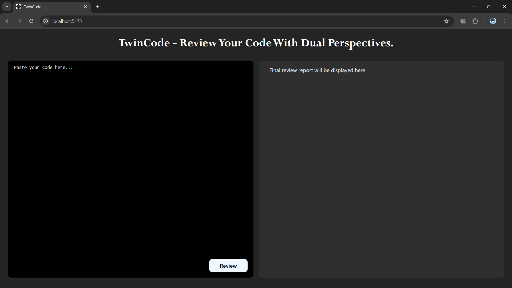
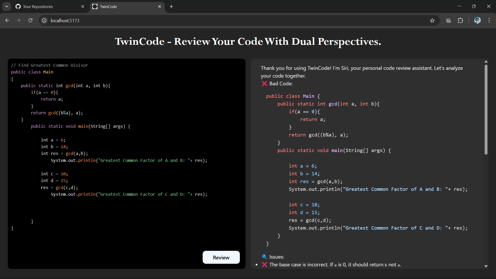

# TwinCode

TwinCode is a web application that allows you to review your code with dual perspectives using AI. It provides insightful, human-like code reviews, including explanations of time and space complexity, potential improvements, and any problematic areas.

## Features

- Code Quality: Ensures clean, maintainable, and well-structured code.
- Best Practices: Suggests industry-standard coding practices.
- Efficiency & Performance: Identifies areas to optimize execution time and resource usage.
- Error Detection: Spots potential bugs, security risks, and logical flaws.
- Scalability: Advises on how to make code adaptable for future growth.
- Readability & Maintainability: Ensures that the code is easy to understand and modify.

## Screenshots

### Home Page


### Code Review



## Usage

1. Paste your code in the left editor pane.
2. Click the "Review" button to get a detailed code review in the right pane.


## Project Structure

```
Backend/
    .env
    .gitignore
    package.json
    server.js
    src/
        app.js
        controllers/
            ai.controller.js
        routes/
            ai.routes.js
        services/
            ai.services.js
Frontend/
    .gitignore
    eslint.config.js
    index.html
    package.json
    README.md
    vite.config.js
    public/
        logo.png
    src/
        App.css
        App.jsx
        index.css
        main.jsx
        assets/
            react.svg
```

## Getting Started

### Prerequisites

- Node.js
- npm

### Backend Setup

1. Navigate to the `Backend` directory:
    ```sh
    cd Backend
    ```

2. Install the dependencies:
    ```sh
    npm install
    ```

3. Create a `.env` file in the `Backend` directory and add your Google Gemini API key:
    ```env
    GOOGLE_GEMINI_KEY=your_google_gemini_key
    ```

4. Start the backend server:
    ```sh
    node server.js
    ```

### Frontend Setup

1. Navigate to the `Frontend` directory:
    ```sh
    cd Frontend
    ```

2. Install the dependencies:
    ```sh
    npm install
    ```

3. Start the frontend development server:
    ```sh
    npm run dev
    ```

4. Open your browser and navigate to `http://localhost:3000`.


## Acknowledgements

- [React](https://reactjs.org/)
- [Vite](https://vitejs.dev/)
- [Express](https://expressjs.com/)
- [Google Generative AI](https://cloud.google.com/generative-ai)
